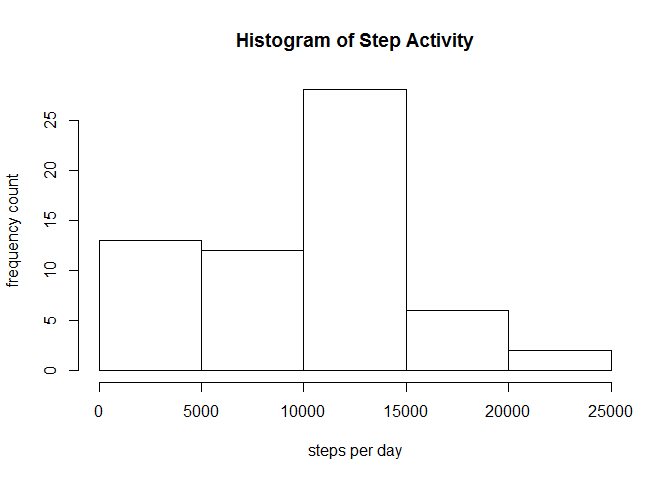
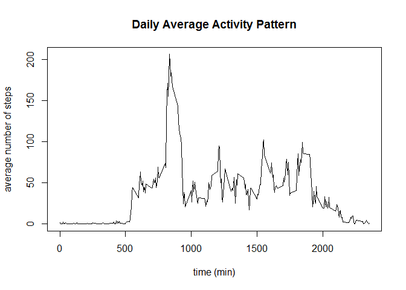
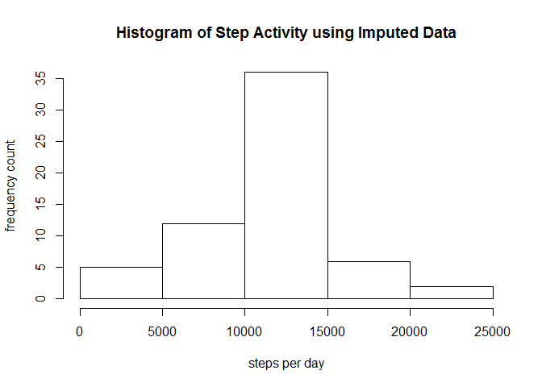
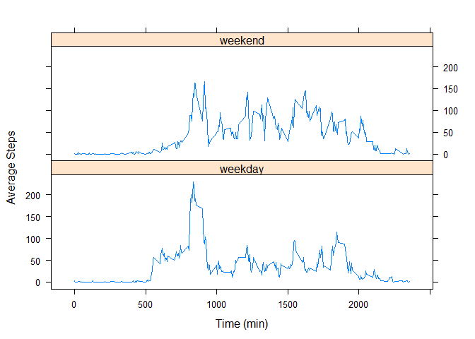

# Reproducible Research: Peer Assessment 1


## Loading and preprocessing the data
Code for reading the dataset into R.  No preprocessing was required.

```r
setwd("c:/Users/David/Documents/GitHub/ActivityData/")
act <- read.csv("./activity.csv")
```


## What is mean total number of steps taken per day?
The following plot shows a histogram of the total steps per day.
 

Calculate the mean and median steps per day.

```r
original.mean <- as.integer(mean(act_by_date$totalsteps))
original.median <- as.integer(median(act_by_date$totalsteps))
```
**The mean of the dataset is 9354 steps/day and the median is 10395 steps/day.**


## What is the average daily activity pattern?
Plot of the average activity by 5-min time interval.

```r
act_by_time <- act %>% group_by(interval) %>% summarize(avgsteps = mean(steps, na.rm = TRUE))
with(act_by_time, plot(interval, avgsteps, type="l", xlab = "time (min)", ylab = "average number of steps",
                       main = "Daily Average Activity Pattern"))
```

 

Find the interval with the highest average steps

```r
hightime <- act_by_time[which.max(act_by_time$avgsteps),]
```
**The highest activity time was a time interval=835 min with an average number of steps=206.**

## Imputing missing values
Replace the NAs with the average steps for each time interval.

```r
m_act <- merge(act, act_by_time)
m_act.na <- is.na(m_act$steps)
m_act$steps[m_act.na] <- m_act$avgsteps[m_act.na]
m_act <- m_act %>% select(steps, date, interval) %>% arrange(date, interval)
head(m_act)
```

```
##       steps       date interval
## 1 1.7169811 2012-10-01        0
## 2 0.3396226 2012-10-01        5
## 3 0.1320755 2012-10-01       10
## 4 0.1509434 2012-10-01       15
## 5 0.0754717 2012-10-01       20
## 6 2.0943396 2012-10-01       25
```

This plot is a histogram of the total number of steps each day or the new imputed dataset.

```r
m_act_by_date <- m_act %>% group_by(date) %>% summarize(totalsteps = sum(steps))
hist(m_act_by_date$totalsteps, xlab = "steps per day", ylab = "frequency count", 
      main = "Histogram of Step Activity using Imputed Data")
```

 

Calculate the mean and median for the imputed dataset

```r
impute.mean <- as.integer(mean(m_act_by_date$totalsteps))
impute.median <- as.integer(median(m_act_by_date$totalsteps))
```
*Mean*  
Original: 9354   Imputed: 10766  

*Median*  
Original: 10395 Imputed: 10766  

**The conclusion is that both the mean and median number of steps per day increased by imputing missing values using the average number of steps for each time interval.**


## Are there differences in activity patterns between weekdays and weekends?
A new column is added to the imputed dataset for whether the date is a weekend or weekday.  The average steps for each time interval is calculated for both weekdays and weekends.

```r
m_act$date <- as.Date(m_act$date)
m_act <- m_act %>% mutate(daytype = factor(weekdays(m_act$date) %in% c("Saturday", "Sunday"), 
                                          labels = c("weekday", "weekend")))
m_act_by_time <- m_act %>% group_by(interval, daytype) %>% summarize(avgsteps = mean(steps))
```

Make a panel plot of activity by time comparing weekends and weekdays.

```r
library(lattice)
xyplot(avgsteps ~ interval | daytype, data = m_act_by_time, layout = c(1,2), type = "l",
          xlab = "Time (min)", ylab = "Average Steps")
```

 
  
More activity on average in the early morning on weekdays compared to weekends. We see more activity later in the middle of the day on the weekends compared to weekday.
